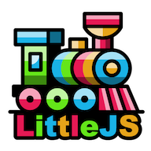

<p align="center">
  
</p>

# LittleJS Template

[](https://github.com/remarkablegames/littlejs-template/releases)
[](https://github.com/remarkablegames/littlejs-template/actions/workflows/build.yml)

<kbd>littlejs-template</kbd> is a template for making [LittleJS](https://github.com/KilledByAPixel/LittleJS) games.

Play the game on:

- [remarkablegames](https://remarkablegames.org/littlejs-template/)

## Prerequisites

[nvm](https://github.com/nvm-sh/nvm#installing-and-updating):

```sh
brew install nvm
```

## Install

Clone the repository:

```sh
git clone https://github.com/remarkablegames/littlejs-template.git
cd littlejs-template
```

Install the dependencies:

```sh
npm install
```

Rename the project:

```sh
git grep -l littlejs-template | xargs sed -i '' -e 's/littlejs-template/my-game/g'
git grep -l 'LittleJS Template' | xargs sed -i '' -e 's/LittleJS Template/My Game/g'
```

Update the files:

- [ ] `README.md`
- [ ] `package.json`
- [ ] `index.html`
- [ ] `public/manifest.webmanifest`
- [ ] `src/game.ts`

## Available Scripts

In the project directory, you can run:

### `npm start`

Runs the game in the development mode.

Open [http://localhost:5173](http://localhost:5173) to view it in the browser.

The page will reload if you make edits.

You will also see any errors in the console.

### `npm run build`

Builds the game for production to the `dist` folder.

It correctly bundles in production mode and optimizes the build for the best performance.

The build is minified and the filenames include the hashes.

Your game is ready to be deployed!

### `npm run bundle`

Builds the game and packages it into a Zip file in the `dist` folder.

Your game can be uploaded to your server, [itch.io](https://itch.io/), etc.

## License

[MIT](LICENSE)
